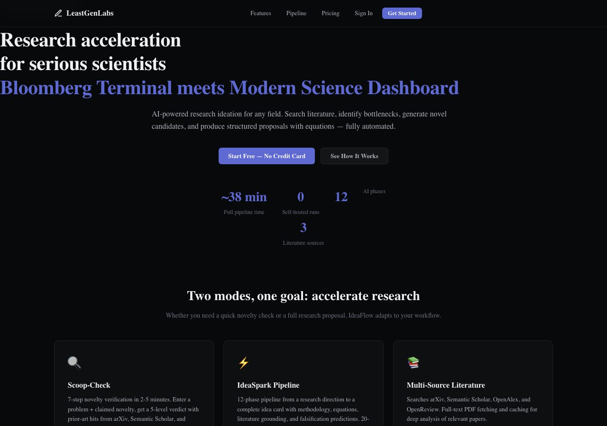
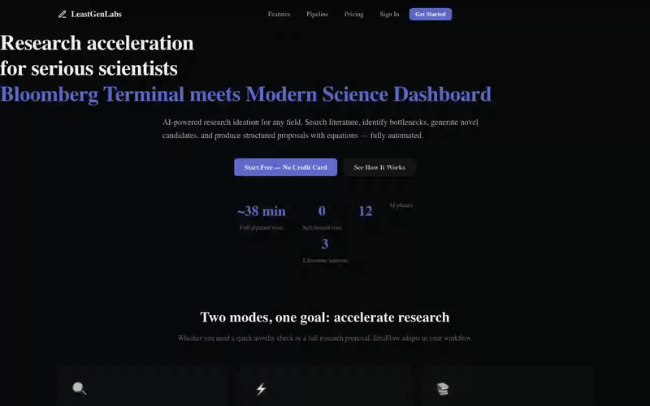

<p align="center">
  <strong>From a research direction to a publication-ready idea card — fully automated.</strong>
  <br>
  <em>A 12-phase AI pipeline that searches the literature, identifies bottlenecks, generates novel candidates, validates novelty, and produces structured research proposals with math notation.</em>
</p>

<p align="center">
  <a href="#-quick-start"></a>
  <a href="#-pipeline-phases"></a>
  <a href="#-novelty-gate"></a>
  <a href="#%EF%B8%8F-architecture"></a>
  <a href="LICENSE"></a>
</p>

<br>

## 📋 Overview

**LeastGen** is an automated research ideation server. Enter a research direction — any direction, in any field — and it produces a complete, structured research proposal with methodology, equations, literature grounding, and falsification predictions.

It works from a single input box:

- **New idea tab — "Your idea" → Check & build.** One field. Pressing **Check & build** starts a pipeline run: Phase 0 literature search runs first, then an LLM novelty gate scores prior-art overlap. If the idea looks scooped, a gate card appears with **Build anyway** / **Revise idea** — you decide. If it looks fresh, the run proceeds straight into the full 12-phase pipeline (20–40 min).
- **Build directly tab — skip the check.** Same pipeline, but it starts from a research direction and builds the idea card without the novelty-gate pause.

**Novelty gate rule:** the gate blocks only on an LLM-backed `max_overlap >= 3` (levels 1–2 of the 5-level verdict). If the LLM is unavailable or its output is unusable, the gate fails open (`llm_unavailable`) and the run proceeds — it never blocks on a fallback verdict.

**Trial:** guests get 1 free run total, tracked client-side via `localStorage` (`leastgen_trial_used`). After that, sign in.

**Built on** [Microsoft Research Studio-Idea](https://github.com/microsoft/ResearchStudio/tree/main/ResearchStudio-Idea), an MIT-licensed ideation framework. LeastGen adds a modern web UI, autonomous orchestration, real-time streaming, and a fast novelty pre-check.

<br>

## ✨ Features
- **English-only** — optimized for English research inputs and outputs

- **Field-agnostic** — works for any discipline: biology, linguistics, sociology, materials science, education, computer science
- **Autonomous LLM orchestration** — 7 LLM phases + 6 automated phases, no manual intervention needed
- **Real-time web UI** — dark-themed SPA with horizontal stepper, KaTeX math rendering, expandable phase details
- **Novelty gate** — LLM-backed overlap check after Phase 0 literature search: blocks only on `max_overlap >= 3`, fails open when the LLM is unavailable; gate card offers **Build anyway** / **Revise idea**
- **1 free trial run** — guest trial tracked in `localStorage`; sign in afterwards
- **Multi-source literature search** — arXiv, Semantic Scholar, OpenAlex, OpenReview
- **Full-text PDF fetching** — automatically retrieves and caches paper PDFs for deep analysis
- **Collision detection** — checks generated candidates against existing literature before committing
- **5-check audit** — evaluates novelty, falsifiability, gap closure, feasibility, and specificity
- **KaTeX-rendered math** — equations in the final idea card render beautifully
- **Self-hosted** — your data, your API key, your server. Run for free with your own OpenRouter key. Or use our Hosted Service for convenience with discounted models and no setup.

<br>

## 🚀 Quick Start

### Prerequisites

- Python 3.11+
- [OpenRouter API key](https://openrouter.ai/keys) for self-hosted usage (FREE) or use our Hosted Service
- 4 GB RAM minimum, 8 GB recommended
- Linux (systemd for auto-restart)

### One-command setup

```bash
curl -fsSL https://raw.githubusercontent.com/LeastGen/leastgen-idea/main/deploy/setup.sh | bash
```

### Manual setup

```bash
# Clone the repo
git clone https://github.com/LeastGen/leastgen-idea.git
cd leastgen-idea

# Create virtual environment
python3 -m venv .venv
source .venv/bin/activate

# Install dependencies
pip install -r requirements.txt

# Fetch the ResearchStudio engine (git-ignored, not in the clone)
bash scripts/fetch_engine.sh

# Set your API key
echo 'OPENROUTER_API_KEY=sk-or-v1-...' >> ~/.kinox/env

# Start the server
uvicorn backend.main:app --host 0.0.0.0 --port 8756
```

Open **http://localhost:8756** in your browser.

### Self-hosting with systemd

```bash
sudo cp deploy/leastgen.service /etc/systemd/system/
sudo systemctl enable leastgen
sudo systemctl start leastgen
```

<br>

## 🔬 Pipeline Phases

The LeastGen Pipeline runs **12 phases** in sequence:

```
Phase 0      Literature search  ─── arXiv, OpenAlex, Semantic Scholar
Phase 0+     Full-text fetch    ─── PDF retrieval and caching
Phase 1      Bottleneck ID      ─── Identify research bottlenecks (LLM)
Phase 2.1    Gap × pattern      ─── Select patterns to address gaps (LLM)
Phase 2.2    Candidate gen      ─── Generate novel idea candidates (LLM)
Phase 2.3    Coherence trace    ─── Algorithm dry-run / coherence check (LLM)
Phase 3.1    Collision check    ─── Prior-art collision detection (automated)
Phase 3.2    5-check audit      ─── Novelty, falsifiability, feasibility (LLM)
Phase 3.3    Revision           ─── Patch flaws found in audit (LLM)
Phase 4      Skeleton → prose   ─── Build idea card with equations (mixed)
```

**Output:** A complete `idea.std.en.md` with:

- Title and motivation
- Methodology with KaTeX equations
- Falsification prediction
- Compute budget
- Related work positioning

### Running the pipeline

```bash
# Start a new pipeline run
./run_pipeline.sh start "efficient speculative decoding for multilingual LLM inference"

# Check status
./run_pipeline.sh status <run-id>

# Watch mode — auto-runs all pending phases
./run_pipeline.sh watch

# List all runs
./run_pipeline.sh list
```

<br>

## 🔍 Novelty gate (was: Scoop-Check)

Every run starts with Phase 0 literature search, then an LLM novelty gate scores prior-art overlap:

```bash
# Start a run with the gate (same as the "Check & build" button)
curl -X POST http://localhost:8756/api/pipeline/start \
  -H "Content-Type: application/json" \
  -d '{"query": "a calibrated per-token early-exit stop rule for efficient LLM inference on long contexts"}'

# If the gate blocks, the run pauses with status "awaiting_gate".
# Continue anyway:
curl -X POST http://localhost:8756/api/pipeline/<run-id>/gate-override
```

Or use the UI at `http://localhost:8756/api/ui`: the gate card shows **Build anyway** / **Revise idea**.

### Gate rule

| max_overlap (LLM-backed) | Level | Gate |
|--------------------------|-------|------|
| 4 | 1 | blocked — strong collision |
| 3 | 2 | blocked — revision advised |
| 2 | 3 | pass — proceeds |
| 1 | 4 | pass — proceeds |
| 0 | 5 | pass — proceeds |

No LLM output → fail open (`llm_unavailable`), never blocks on a fallback verdict. (The standalone `/api/scoop-check/*` endpoints remain for direct novelty queries.)

<br>

## 🏗️ Architecture

```
leastgen/
├── backend/
│   ├── main.py              # FastAPI application entry point
│   └── routers/
│       ├── ui.py            # Frontend SPA server
│       ├── pipeline.py      # Pipeline orchestration
│       ├── scoop.py         # Scoop-Check API
│       ├── auto.py          # Auto phase trigger
│       ├── phases.py        # Phase execution endpoints
│       ├── results.py       # Result retrieval
│       ├── fulltext.py      # Full-text fetch
│       ├── dashboard.py     # Legacy dashboard
│       └── health.py        # Health check & diagnostics
├── frontend/
│   ├── index.html           # SPA entry point
│   ├── style.css            # Design system (dark theme)
│   └── app.js               # Application logic
├── researchstudio/           # Microsoft ResearchStudio-Idea engine
├── llm_bridge.py             # OpenRouter LLM bridge
├── run_pipeline.sh           # Pipeline orchestrator
├── run_llm_phase.py          # Autonomous LLM phase runner
├── run_scoop.py              # Scoop-Check runner
├── deploy/
│   └── leastgen.service          # systemd service unit
└── LICENSE                   # MIT
```

### Tech stack

| Layer | Technology |
|-------|-----------|
| **Backend** | Python 3.11+, FastAPI, Uvicorn |
| **Frontend** | Vanilla JS SPA, KaTeX, marked |
| **LLM** | OpenRouter (deepseek/deepseek-v4-flash, 1M context) |
| **Literature** | arXiv (feedparser), Semantic Scholar, OpenAlex |
| **Ideation Engine** | Microsoft Research Studio-Idea (MIT) |
| **Deployment** | systemd, self-hosted |

<br>

## 📊 Benchmark

Single full pipeline run:

| Metric | Value |
|--------|-------|
| **End-to-end time** | ~38 minutes |
| **API cost** | ~$0.33 (deepseek-v4-flash) |
| **LLM calls** | 7 |
| **Automated phases** | 6 |
| **Papers searched** | ~37 across 3 libraries |
| **Collision hits checked** | ~240 |

<br>

## ⚙️ Configuration

| Variable | Purpose | Default |
|----------|---------|---------|
| `OPENROUTER_API_KEY` | OpenRouter API key | (required) |
| `IDEAS_FLOW_FAST_MODEL` | Fast model for classify tasks | `deepseek/deepseek-v4-flash` |
| `IDEAS_FLOW_LARGE_MODEL` | Large model for reasoning | `deepseek/deepseek-v4-flash` |
| `IDEAS_FLOW_TIMEOUT` | LLM call timeout in seconds | `180` |

Configurable via `~/.kinox/env` or environment variables.

<br>

## 📸 Screenshots

> *The UI is a dark-themed SPA with two tabs (New idea → Check & build; Build directly → skip the check), a novelty-gate card (Build anyway / Revise idea), a horizontal stepper, and KaTeX-rendered math.*
>
> Visit `http://localhost:8756/api/ui` to see it in action.

<br>

## 🗺️ Roadmap

- [ ] Pattern_summary parallelization (currently 37 sequential LLM calls → batch)
- [ ] Phase 3.2 input truncation (collision_hits.json → top 50 hits)
- [ ] Docker container
- [ ] WebSocket real-time streaming
- [ ] Export to PDF/LaTeX
- [ ] Multi-query batch mode
- [ ] Citation graph visualization

<br>

## 🏠 Open Source & Hosted Service

LeastGen is fully open source (MIT License) — you can clone, modify, and self-host for free. We also offer a hosted service with discounted models and no setup:

| Plan | Runs | Price | Best For |
|------|------|-------|----------|
| **Self-Hosted** | Unlimited | FREE (you pay OpenRouter) | Developers with existing keys |
| **Free (Hosted)** | 10/mo | FREE | Quick testing without server setup |
| **Pro Monthly** | Unlimited | $29/mo | Regular researchers |
| **Pro Yearly** | Unlimited | $290/yr | Teams & long-term users |

**Hosted Service:** We route through our discounted OpenRouter account with a 30% convenience margin covering server costs, support, and maintenance.

See [docs/HOSTING.md](docs/HOSTING.md) for detailed hosting options.

## 🤝 Contributing

Contributions are welcome! Open an issue or PR for:

- New literaturesearch connectors
- Additional ideation patterns
- UI improvements
- Performance optimizations
- Bug fixes

<br>

## 📄 License

MIT — see [LICENSE](LICENSE).

Built on [Microsoft Research Studio-Idea](https://github.com/microsoft/ResearchStudio/tree/main/ResearchStudio-Idea) — the ideation framework behind the pipeline phases. Both projects are MIT-licensed.

<br>

## 🙏 Acknowledgements

- [Microsoft Research Studio-Idea](https://github.com/microsoft/ResearchStudio/tree/main/ResearchStudio-Idea) for the ideation framework
- [OpenRouter](https://openrouter.ai/) for accessible LLM inference
- [arXiv](https://arxiv.org/), [Semantic Scholar](https://www.semanticscholar.org/), and [OpenAlex](https://openalex.org/) for open research literature access

---

<p align="center">
  <sub>Built with ❤️ for open research acceleration.</sub>
</p>